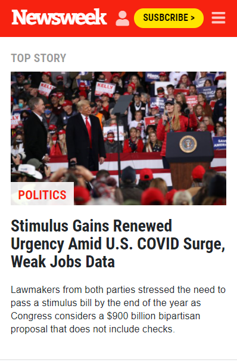

# Project Name
Project 3 - Bootstrap

> This project is a clone of the newsweek webpage.

This project is responsive and has 3 versions: mobile, tablet and desktop.

## Built With

- HTML
- SCSS
- Bootstrap

## Live Demo

[Live Demo Link](https://tasheka.github.io/Bootstrap-Project/)

## Authors

👤 Oever González

- GitHub: [@NoTengoBattery](https://github.com/NoTengoBattery)
- Twitter: [@NoTengoBattery](https://twitter.com/NoTengoBattery)
- LinkedIn: [LinkedIn](https://www.linkedin.com/in/jos%C3%A9-oever-gonz%C3%A1lez-hern%C3%A1ndez-7b822a1b6/)

👤 Tasheka Hamilton

- GitHub: [@Tasheka](https://github.com/Tasheka)
- LinkedIn: [LinkedIn](https://www.linkedin.com/in/tasheka-hamilton-43532311b/)

## 🤝 Contributing

Contributions, issues, and feature requests are welcome!

Feel free to check the [issues page](https://github.com/Tasheka/Bootstrap-Project/issues).

## Show your support

Give a ⭐️ if you like this project!

## 📝 License

This project is [MIT](lic.url) licensed.
